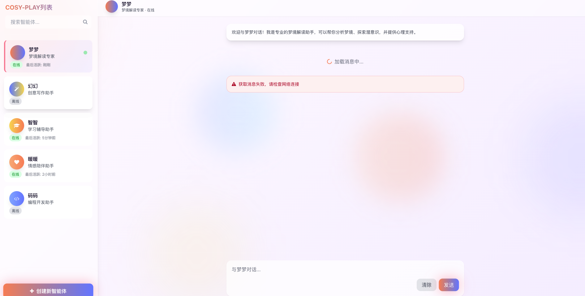
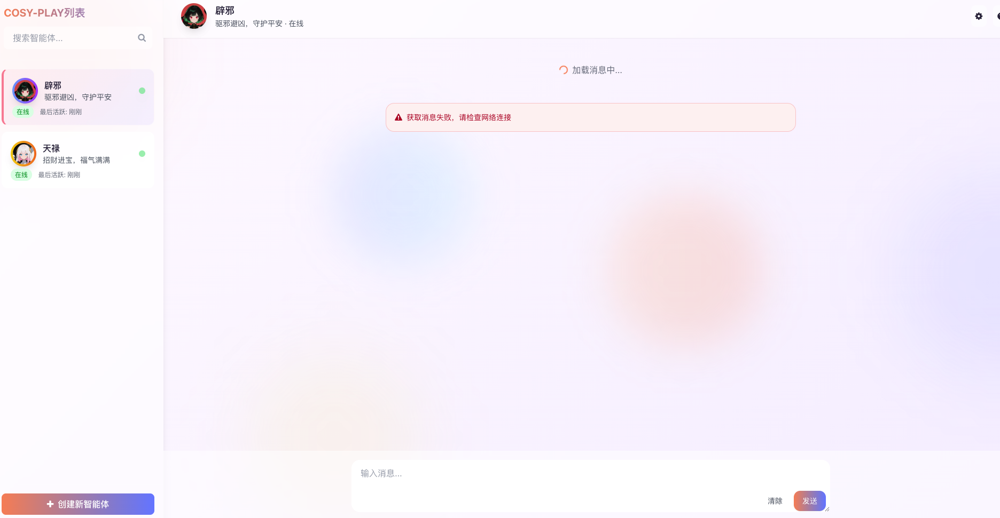

# 🦋 ButterFlyDream - 梦幻Live2D智能体对话系统

> **✨ 一个集成了现代化UI设计、多模型支持和智能交互的Live2D项目**

欢迎来到ButterFlyDream！这是一个精心打造的Live2D智能体对话系统，融合了梦幻般的视觉设计和流畅的用户体验。项目采用最新的前端技术栈，为开发者提供开箱即用的Live2D解决方案。


# 手机使用图：


# 智能对话框



# 实机对话框



## 🌟 项目特色

### 🎨 梦幻视觉设计
- **渐变色彩方案**：采用梦幻粉、紫、蓝配色，营造沉浸式体验
- **毛玻璃效果**：现代化UI设计，支持背景模糊和半透明效果
- **动态背景**：浮动气泡和光晕动画，增强视觉吸引力
- **响应式布局**：完美适配各种屏幕尺寸

### 🤖 智能体对话系统
- **多智能体支持**：内置COSY-PLAY智能体列表，支持快速切换
- **实时对话界面**：现代化的聊天界面设计
- **交互式控制**：表情切换、语音交互、动作控制
- **个性化配置**：支持自定义模型和交互方式

### 🎭 Live2D模型集成
- **多模型支持**：集成Seele、伊莉雅、yiyier等高质量模型
- **Cubism 2/3兼容**：支持不同版本的Live2D模型
- **拖拽交互**：支持模型拖拽和位置调整
- **音频修复**：内置音频问题修复方案

## 🚀 快速开始

### 环境要求
- 现代浏览器（支持HTML5 Canvas）
- 基本的Web服务器环境（本地开发可使用Live Server）

### 安装步骤

1. **克隆项目**
```bash
git clone https://gitee.com/yanhuaichuan/buffer-fly-dream.git
cd buffer-fly-dream
```

2. **启动项目**
```bash
# 使用Python简单服务器
python -m http.server 8000

# 或使用Node.js的http-server
npx http-server
```

3. **访问应用**
打开浏览器访问 `http://localhost:8000` 即可体验完整功能

## 📁 项目结构

```
ButterFlyDream/
├── index_meme.html          # 主页面 - 梦幻世界界面
├── index2.html              # 智能体对话界面
├── js/
│   ├── LAppDefine.js        # Live2D配置文件
│   ├── live2d.js           # Live2D核心库
│   └── live2d-extensions.js # Live2D扩展功能
├── audio-fix.js            # 音频修复脚本
├── model/                   # Live2D模型目录
│   ├── seele/              # Seele模型
│   ├── illyasviel/         # 伊莉雅模型
│   └── yiyier/             # yiyier模型
├── cosy_play_list/         # COSY智能体配置
├── chitose/                # 千岁模型资源
└── live2d-master.code-workspace  # VS Code工作区配置
```

## 🎯 核心功能

### 1. 梦幻世界界面 (`index_meme.html`)
- **沉浸式体验**：全屏Live2D模型展示
- **动态背景**：浮动气泡和光晕效果
- **交互控制**：支持模型拖拽和动作切换
- **响应式设计**：完美适配移动端和桌面端

### 2. 智能体对话界面 (`index2.html`)
- **智能体列表**：左侧面板显示可用智能体
- **实时对话**：现代化的聊天界面
- **搜索功能**：快速查找智能体
- **状态管理**：智能体在线状态显示

### 3. Live2D配置 (`js/LAppDefine.js`)
```javascript
var LAppDefine = {
    CANVAS_ID: "live2d",      // Canvas元素ID
    IS_DRAGABLE: true,        // 是否允许拖拽
    MODELS: [                 // 模型配置
        ["model/seele/model.json"],
        ["model/illyasviel/illyasviel.model.json"],
        ["model/yiyier/mao_pro.model3.json"]
    ]
};
```

## 🛠️ 自定义配置

### 添加新模型
1. 将模型文件放入 `model/` 目录
2. 在 `js/LAppDefine.js` 的 `MODELS` 数组中添加模型路径
3. 刷新页面即可看到新模型

### 修改主题色彩
编辑HTML文件中的Tailwind配置：
```javascript
tailwind.config = {
    theme: {
        extend: {
            colors: {
                primary: '#FF8A9A',    // 主色调
                secondary: '#9D8AFF',  // 辅助色
                accent: '#8AEEFF'      // 强调色
            }
        }
    }
}
```

### 自定义交互行为
修改 `js/LAppDefine.js` 中的配置项：
- `IS_DRAGABLE`: 控制是否允许拖拽
- `BUTTON_ID`: 绑定交互按钮
- 自定义鼠标事件处理逻辑

## 🌐 浏览器兼容性

| 浏览器 | 支持状态 | 备注 |
|--------|----------|------|
| Chrome | ✅ 完全支持 | 推荐使用 |
| Firefox | ✅ 完全支持 |  |
| Safari | ✅ 完全支持 |  |
| Edge | ✅ 完全支持 |  |
| IE 11 | ❌ 不支持 | 需要Polyfill |

## 📱 移动端支持

项目已针对移动设备进行优化：
- **触摸交互**：支持触摸拖拽和点击
- **响应式布局**：自适应不同屏幕尺寸
- **性能优化**：针对移动设备进行渲染优化

## 🔧 开发指南

### 技术栈
- **HTML5 + CSS3**: 现代化Web标准
- **Tailwind CSS**: 实用优先的CSS框架
- **JavaScript ES6+**: 现代JavaScript语法
- **Live2D Cubism**: 2D实时渲染技术

### 开发环境搭建
1. 安装VS Code并打开工作区文件
2. 安装Live Server扩展
3. 右键HTML文件选择"Open with Live Server"

### 调试技巧
- 使用浏览器开发者工具查看Canvas渲染
- 检查Console输出调试信息
- 使用Network面板监控资源加载

## 🤝 贡献指南

我们欢迎各种形式的贡献！

### 如何贡献
1. Fork 本仓库
2. 创建特性分支 (`git checkout -b feature/AmazingFeature`)
3. 提交更改 (`git commit -m 'Add some AmazingFeature'`)
4. 推送到分支 (`git push origin feature/AmazingFeature`)
5. 开启Pull Request

### 贡献类型
- 🐛 Bug修复
- ✨ 新功能开发
- 📚 文档改进
- 🎨 UI/UX优化
- 🔧 性能优化

## 📄 许可证

本项目基于MIT许可证开源，您可以自由使用、修改和分发。

**重要提醒**：项目中包含的Live2D模型资源版权归原版权方所有，仅供学习和非商业用途使用。

## 🌟 致谢

感谢以下项目和资源的支持：
- [Live2D官方](https://www.live2d.com/) - 核心渲染技术
- [Tailwind CSS](https://tailwindcss.com/) - CSS框架
- [Font Awesome](https://fontawesome.com/) - 图标库
- 所有模型的原作者和版权方

## 📞 联系我们


如有问题或建议，欢迎通过以下方式联系：
- 项目主页：https://gitee.com/yanhuaichuan/buffer-fly-dream
- 邮箱：项目维护者邮箱
- Issue：在Gitee提交Issue

---

**✨ 让ButterFlyDream为您的项目增添梦幻般的交互体验！**

> *"在梦幻的世界里，每一次交互都是一次奇妙的旅程"*

# 公众号： 


